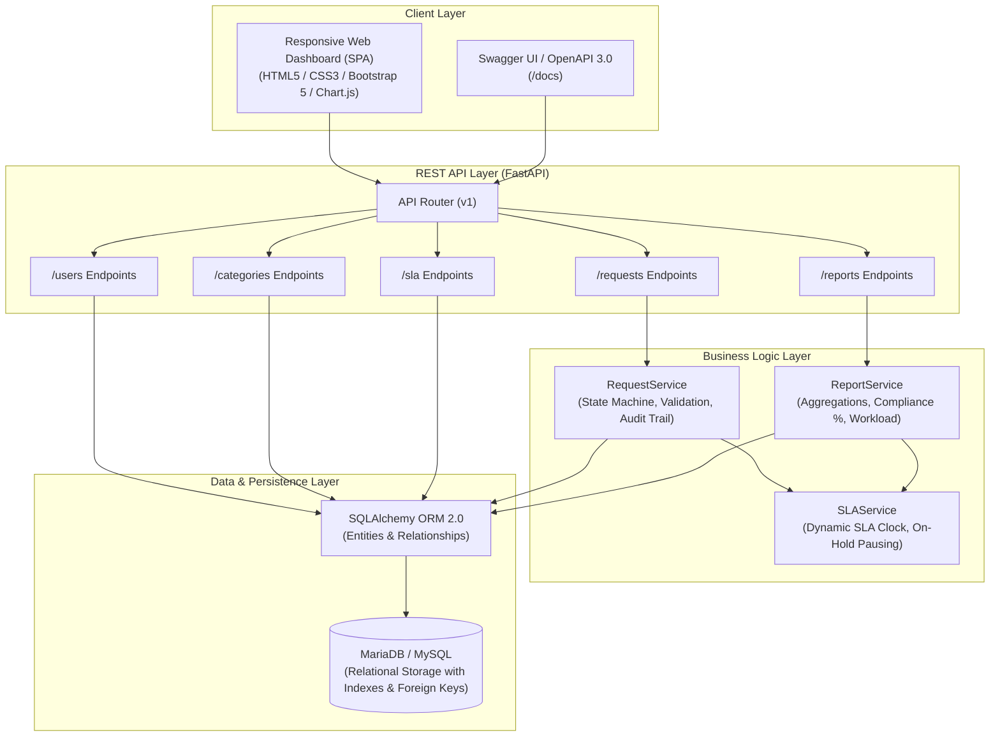
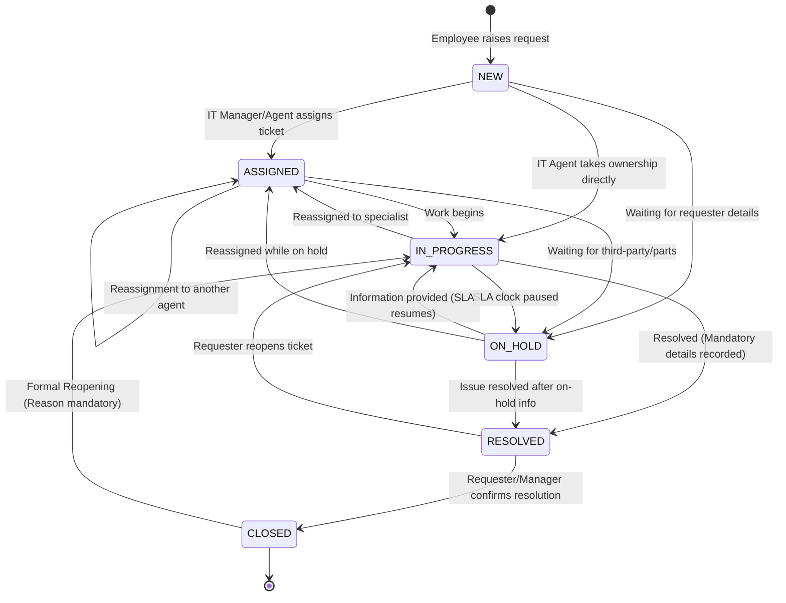

# System Architecture & Design Documentation

## 1. High-Level Architectural Overview

The **IT Service Request Management System** is built using a modern **Layered Service-Oriented Architecture (SOA)** with clear separation of concerns across presentation, API routing, business domain services, data access / ORM, and persistence layers.

---

## 2. Request Lifecycle State Machine

The system enforces strict lifecycle state transitions to guarantee operational integrity. Requests cannot jump between inappropriate states (e.g. `NEW` directly to `CLOSED`).

### Transition Matrix & Enforcement Rules
| From State | Allowed Target States | Mandatory Requirements / Constraints |
| :--- | :--- | :--- |
| **`NEW`** | `ASSIGNED`, `IN_PROGRESS`, `ON_HOLD` | Assignee must belong to IT Team (`IT_SUPPORT`, `IT_MANAGER`, `ADMIN`). |
| **`ASSIGNED`** | `IN_PROGRESS`, `ON_HOLD`, `ASSIGNED` | Reassignment updates audit log with old and new technician. |
| **`IN_PROGRESS`** | `ON_HOLD`, `RESOLVED`, `ASSIGNED` | Cannot transition to `CLOSED` directly without resolution. |
| **`ON_HOLD`** | `IN_PROGRESS`, `ASSIGNED`, `RESOLVED` | Pauses SLA countdown; elapsed hold time is recorded into `total_on_hold_seconds`. |
| **`RESOLVED`** | `CLOSED`, `IN_PROGRESS` (Reopen) | `resolution_details` and `resolved_by_id` are strictly enforced. |
| **`CLOSED`** | `IN_PROGRESS` (Reopen only) | Closed tickets are immutable; cannot be edited or commented on without explicit Reopening. |

---

## 3. SLA Calculation & Real-Time Monitoring Engine

### SLA Parameters (Default Hackathon Spec)
- **Critical:** 4 hours resolution SLA
- **High:** 8 hours resolution SLA
- **Medium:** 24 hours resolution SLA
- **Low:** 48 hours resolution SLA

### Dynamic Calculation Model
1. **Clock Initialization:** The SLA clock starts immediately at `created_at`.
2. **On-Hold Compensation:** When a ticket enters `ON_HOLD`, `on_hold_started_at` is timestamped. Upon leaving `ON_HOLD`, the elapsed hold duration is added to `total_on_hold_seconds`.
$$\text{SLA Due Date} = \text{Created At} + \text{SLA Target Duration} + \text{Total On-Hold Duration}$$
3. **Breach Determination:**
   - **For Open Tickets:** $\text{Is Breached} = \text{Current UTC Time} > \text{SLA Due Date}$.
   - **Approaching Breach Warning:** Triggered when $\ge 75\%$ of the allotted SLA time has elapsed.
   - **For Resolved/Closed Tickets:** Evaluated by checking if $\text{Resolved At} \le \text{SLA Due Date}$.
4. **Dynamic Configuration:** SLA target hours per priority are stored in the database (`sla_configs` table) and can be modified at runtime via the `/api/v1/sla` API without redeploying code.
