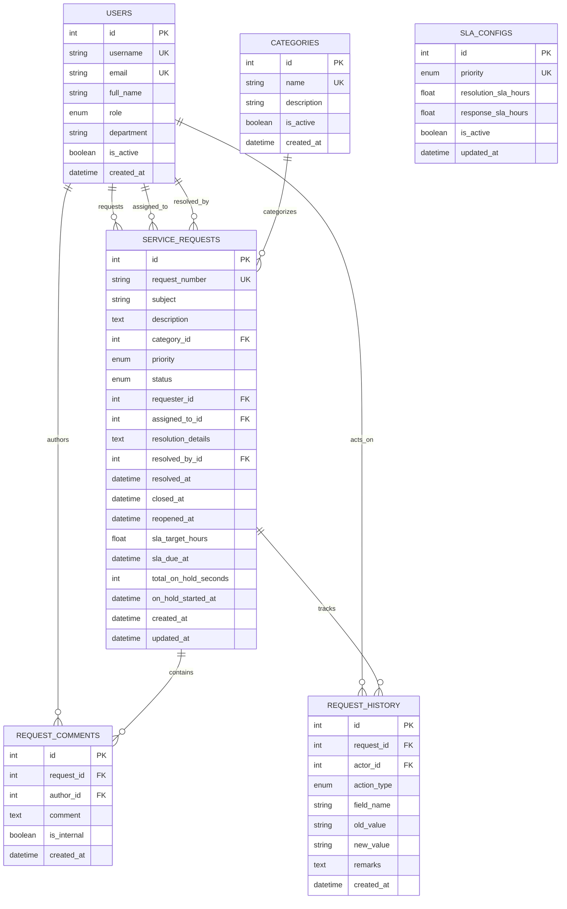

# Database Design & Relational Schema

## 1. Entity-Relationship Overview

The database is designed with full 3rd Normal Form (3NF) relational principles, strict foreign key constraints, check constraints, and performance indexes.

---

## 2. Table Specifications & Index Strategy

### `users`
- **Primary Key:** `id` (Auto Increment)
- **Unique Constraints:** `username`, `email`
- **Indexes:** `idx_users_role` (`role`), `idx_users_active` (`is_active`)

### `categories`
- **Primary Key:** `id` (Auto Increment)
- **Unique Constraints:** `name`
- **Indexes:** `idx_categories_active` (`is_active`)

### `sla_configs`
- **Primary Key:** `id` (Auto Increment)
- **Unique Constraints:** `priority`
- **Purpose:** Stores configurable SLA hours per priority (`CRITICAL`, `HIGH`, `MEDIUM`, `LOW`).

### `service_requests`
- **Primary Key:** `id` (Auto Increment)
- **Unique Constraints:** `request_number` (`SR-YYYY-NNNN`)
- **Foreign Keys:**
  - `fk_req_category`: `category_id` $\rightarrow$ `categories.id` (`ON DELETE RESTRICT`)
  - `fk_req_requester`: `requester_id` $\rightarrow$ `users.id` (`ON DELETE RESTRICT`)
  - `fk_req_assigned`: `assigned_to_id` $\rightarrow$ `users.id` (`ON DELETE SET NULL`)
  - `fk_req_resolver`: `resolved_by_id` $\rightarrow$ `users.id` (`ON DELETE SET NULL`)
- **Composite & High-Performance Indexes:**
  - `idx_req_status_priority` (`status`, `priority`): Optimizes executive dashboard grouping.
  - `idx_req_assigned_status` (`assigned_to_id`, `status`): Optimizes IT technician workload queries.
  - `idx_req_requester_status` (`requester_id`, `status`): Accelerates requester ticket portal filtering.
  - `idx_req_sla_due` (`sla_due_at`): Speeds up real-time SLA breach and overdue monitoring.
  - `idx_req_created_at` (`created_at`): Enables fast time-series reporting.

### `request_comments`
- **Primary Key:** `id`
- **Foreign Keys:** `request_id` $\rightarrow$ `service_requests.id` (`ON DELETE CASCADE`), `author_id` $\rightarrow$ `users.id` (`ON DELETE RESTRICT`)
- **Indexes:** `idx_comm_request_created` (`request_id`, `created_at`)

### `request_history`
- **Primary Key:** `id`
- **Foreign Keys:** `request_id` $\rightarrow$ `service_requests.id` (`ON DELETE CASCADE`), `actor_id` $\rightarrow$ `users.id` (`ON DELETE SET NULL`)
- **Indexes:** `idx_hist_request_created` (`request_id`, `created_at`)
